# Air conditioning Profile
#### 工具：Excel、Tableau
#### 数据来源：某电商平台
#### 注：个人实战锻炼项目，欢迎交流与勘误

## 项目背景
项目概览：抓取某电商平台方的该类目下所有商品数据，进行平台上商品画像梳理，总结商品运营过程中应关注的点，指导企业进行精细化运营。

### 数据说明

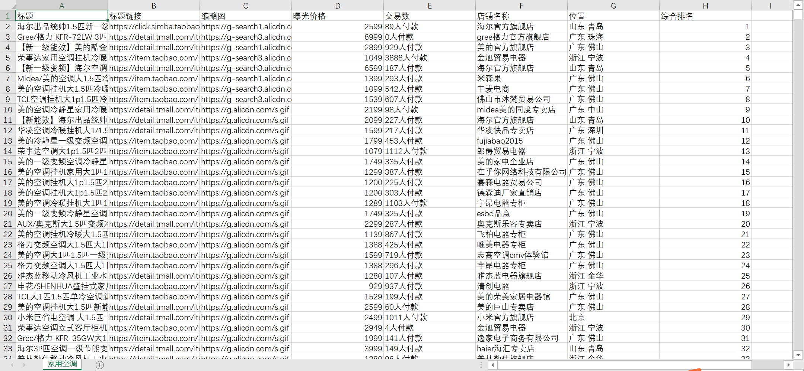 

## 分析目的
本项目作为个人练习项目：
- ①进一步了解家电行业；
- ②角色代入，找到我们的竞争对手，观察我们的优势在哪

## 分析思路

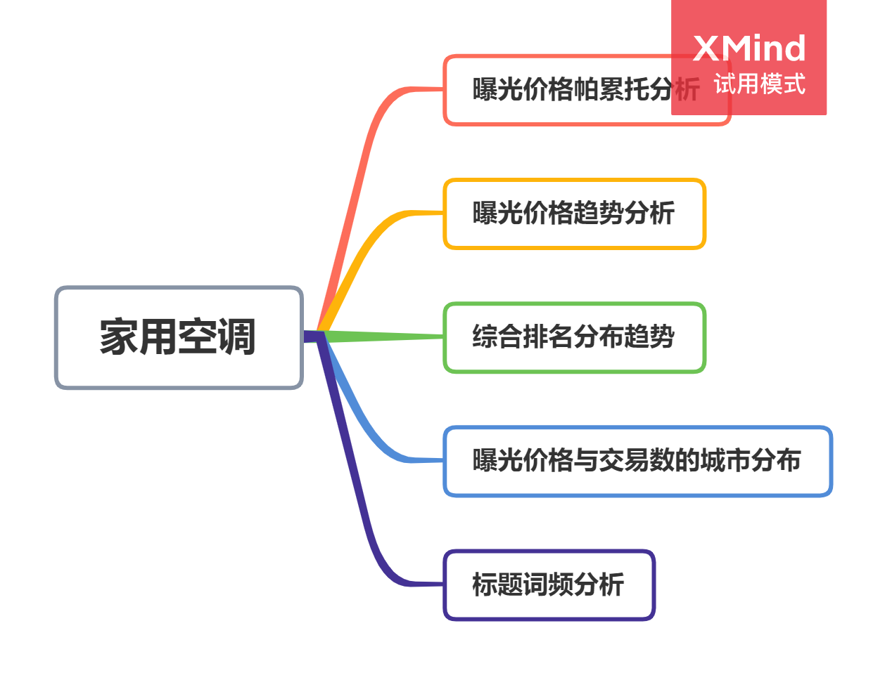

## 数据清洗及有效数据筛选

### 异常值处理

过滤掉曝光价格小于700的数据，保留更多与“家用空调”相关的数据

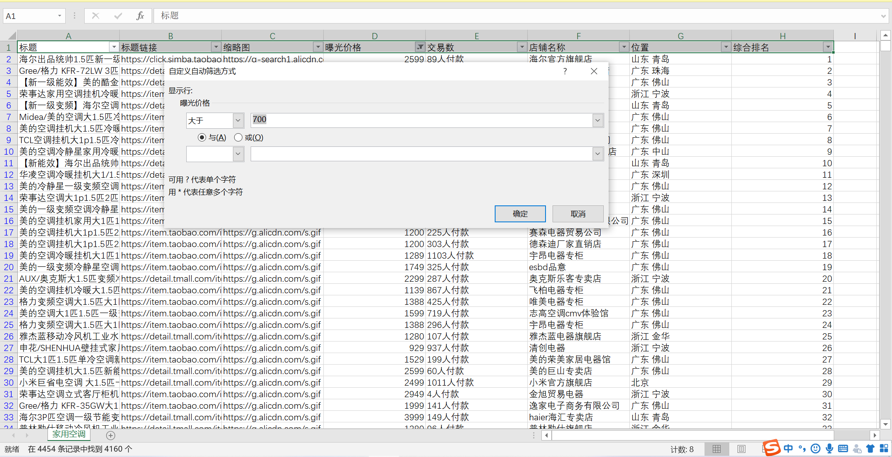 

### 格式处理

交易数，利用“人”作为分隔符，进行分列，保留数字列

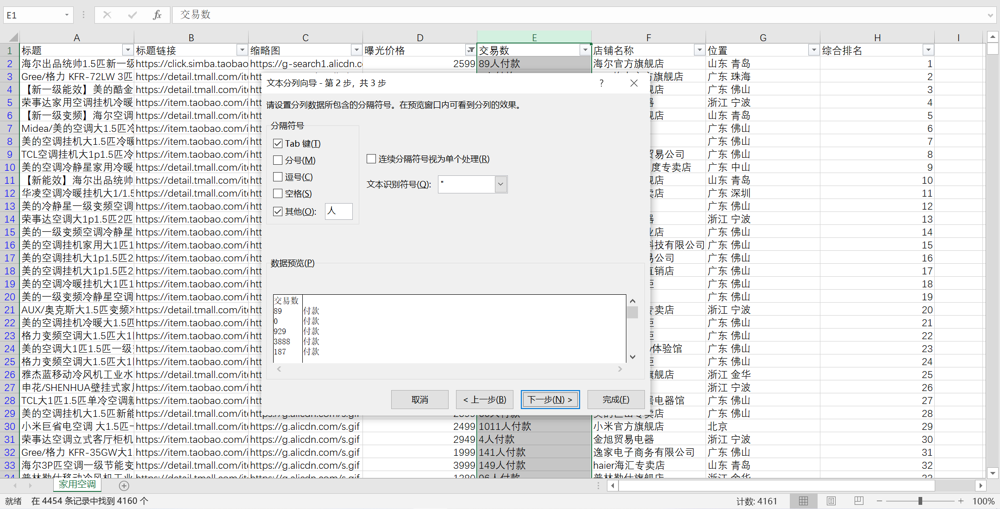 
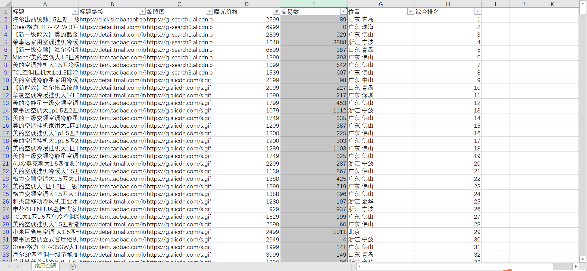 

## 数据分析

### 曝光价格帕累托分析

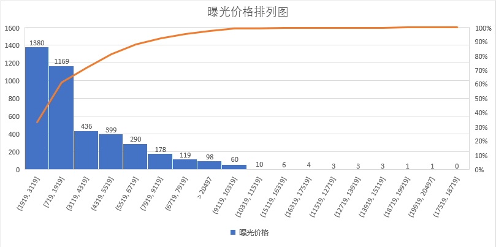 

通过曝光价格分析，可以知道进入一个家用空调类目下，商品价格范围最好在[1919,3119]，[710,1919]波动。

### 曝光价格趋势分析

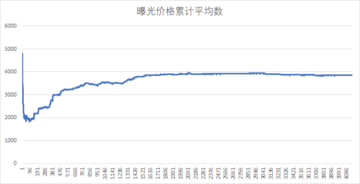 

反映了曝光价格的趋势，曝光价格累计平均数先暴跌，后增加，再缓慢降低

头部可能存在商品刚刚上架，价格也偏高，但可能对其投放了广告营销，获得更大的曝光

搜索“家用空调”的用户一般只会翻到十几页，在前200~300名，价格优势是存在的

### 综合排名分布趋势

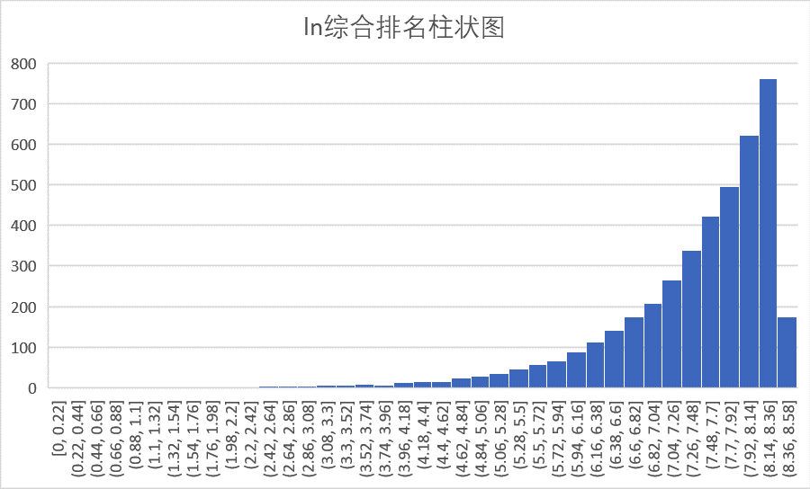 

通过排名，可以得出大多数商品都在2000~3000多名（EXP(8.14)=3429），少数商品排在前面，在家用空调这个类目，得达到 ln4.62（前100名）以内，才有一个不错的销量以及曝光。

### 曝光价格与交易数的城市分布

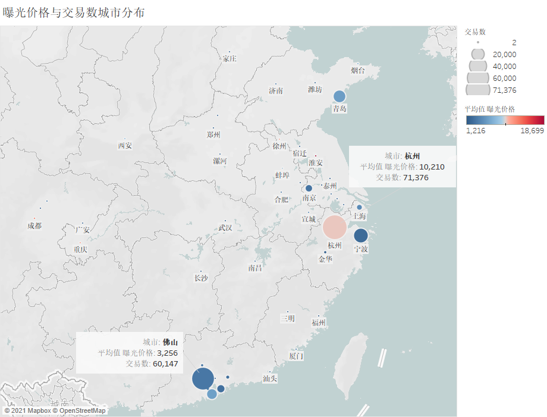 

家用空调制造（发地）主要集中在沿海一带，杭州、佛山、宁波、青岛位列前首，而其中杭州的平均曝光价格远高于佛山的平均曝光价格，价格偏高的家用空调一般以大匹数中央空调。不同地区的用户对于空调的参数需求不一致，可以对比竞争对手，观察自身的优势在哪。让不同的家用空调迅速匹配到处在不同地域、时间、偏好、阶层中的消费者，进而去更加优化用户的体验。

### 商品标题词频分析（静态比较）
top100:标题的词汇分布，最头部产品关键词选择  
占比比较（top100与top4163）
搜索排序前100的商品词频分析中TOP20的词汇
 

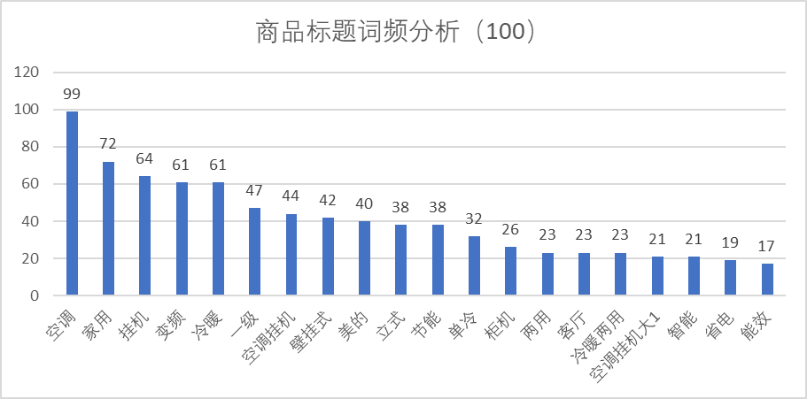 
搜索排序前4163的商品词频分析中TOP20的词汇
 

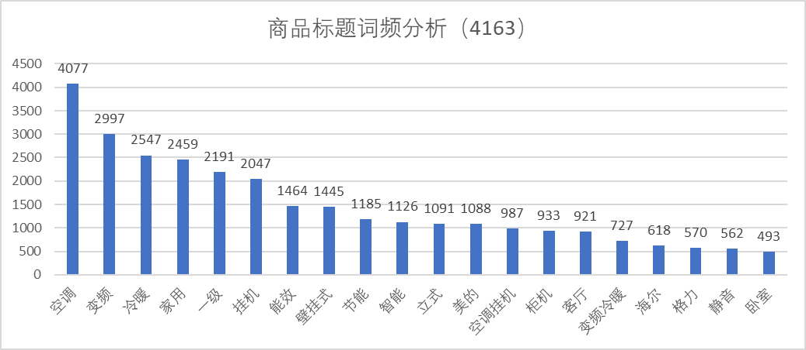 

搜索排序前100与前4163的商品词频分析中TOP20的词汇
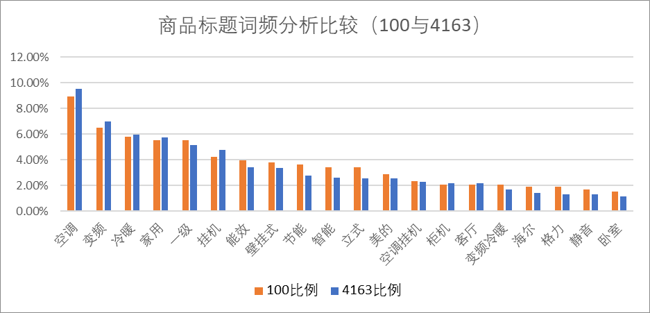 

### 商品标题静态词频分析（词云图）
 

由上图可知，”冷暖“、”变频“、”能效“、”壁挂式“等关键词出现频率高，也是目前家用空调的热点词，这一部分都是产品品质、产品卖点、产品受众的宣传词，大多数卖家注重宣传。
怎么的标题是优秀的？标题优化思路，热点词代表当下用户需求，而部分词汇是未来的趋势。

## 总结
- 上架新品时，商家可以参考价格区间[1919,3119]，[710,1919]，定位产品，有利于获取更多曝光
- 商家可以通过一些营销手段，如控评、广告投放等，让商品曝光在100名内，可以获得一个不错的销量
- 优先考虑沿海城市的供应商，从家用空调而言，主要生产线分布在沿海一带
- 地域性精细化运营，不同地域，对于家用空调的匹数、变频等参数有独特需求

## 思考🤔
卖出去，怎么卖？
- 我们的产品能符合用户需求
- 我们的产品比竞争对手要好
